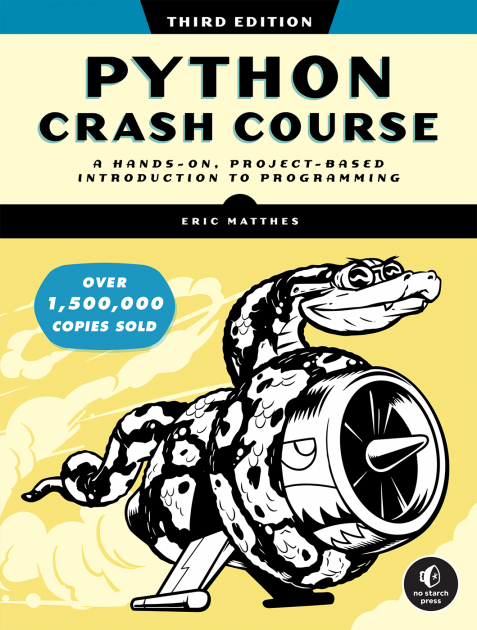

### This is my take on the _PYTHON CRASH COURSE 3rd EDITION: A Hands-On, Project-Based Introduction to Programming_ Book by _[Eric Matthes](https://ehmatthes.github.io/)_ 

Note: For Chapter 11, Create a virtual environment with the packages from [requirements.txt](Exercises/Ch11/requirements.txt) and then run the solution programs.

Part II - Projects' Source Code:
- Chapter 18-20 [Django-Learning-Log](https://github.com/Shreehar-KE/pcc-django-learning-log)
- Chapter 18-20 [Django-Blog](https://github.com/Shreehar-KE/pcc-django-blog)
